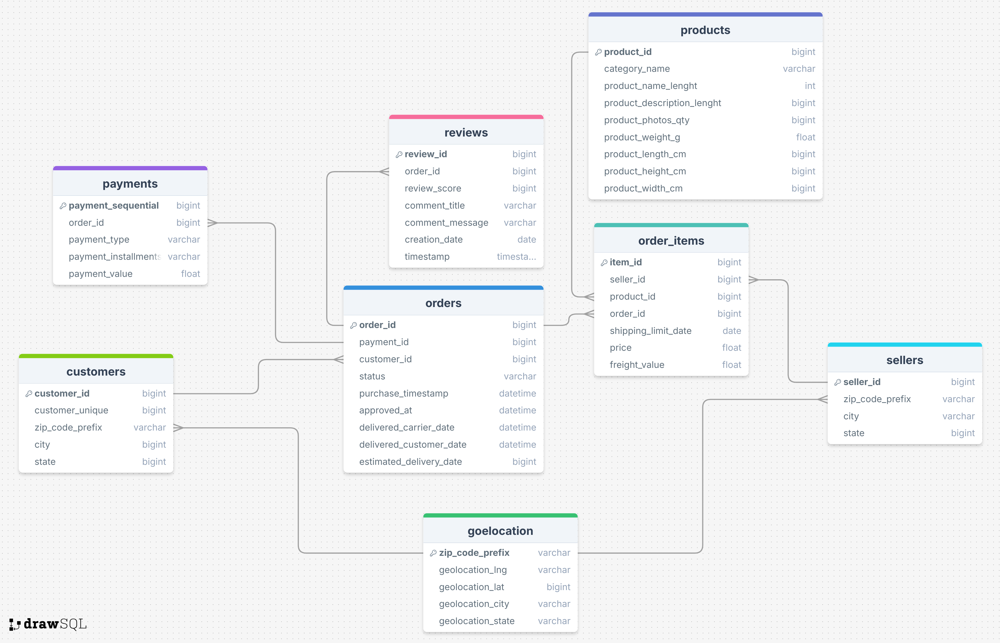
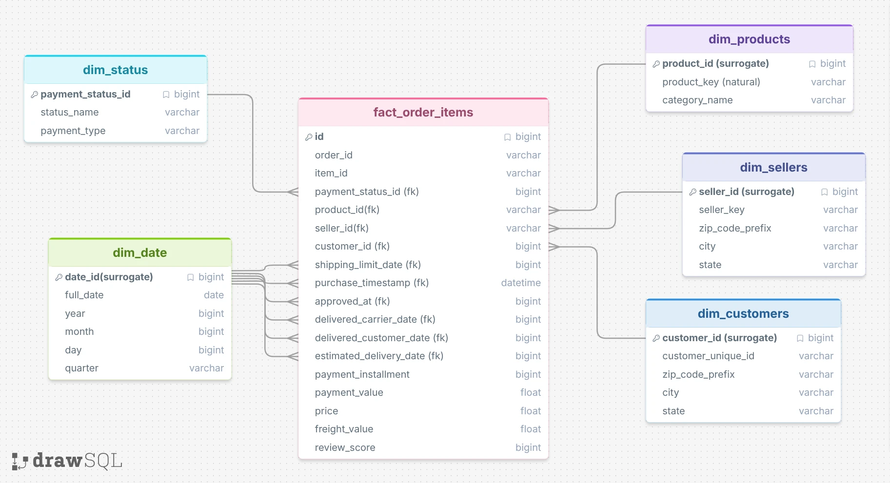
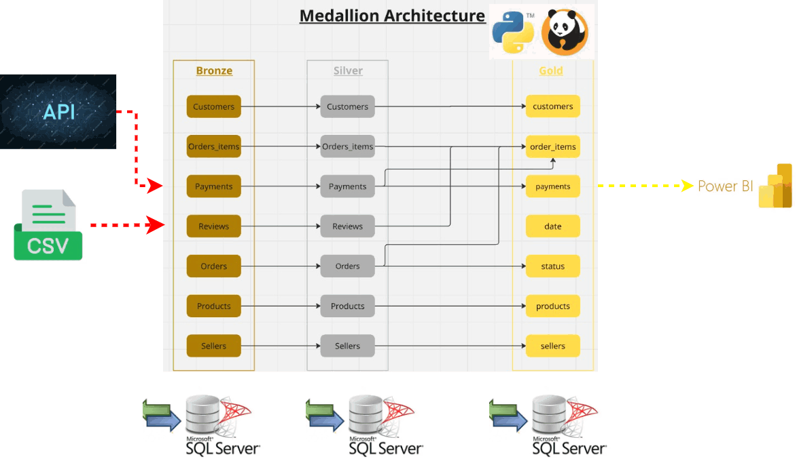
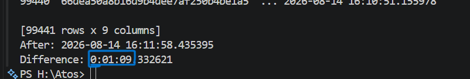
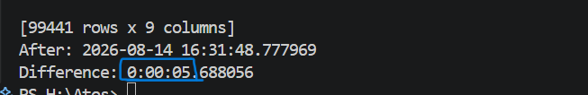

<details>
<summary><b>PROJECT OVERVIEW</b></summary>
  
# <div>**Project Overview**</div>
- **This project analyzes the Brazilian E-Commerce Public Dataset by Olist, which contains over 100,000 orders placed between 2016 and 2018 across multiple marketplaces in Brazil. The dataset offers a comprehensive view of the e-commerce ecosystem — from order placement to delivery and customer satisfaction.
The main goal of this project is to explore, clean, and analyze the data to uncover meaningful business insights and performance indicators, such as delivery efficiency, payment behavior, product trends, and customer feedback.**
--------------------------------------------------------------------------------------------------
</details>
<details>
<summary><b>DATA DESCRIPTION</b></summary>

<br>

The dataset includes several interconnected tables, allowing multi-dimensional analysis:

- <b>Orders:</b> Order status, purchase timestamp, approval time, and delivery performance.

- <b>Payments:</b> Payment type, installments, and payment values.

- <b>Logistics:</b> Freight cost and delivery times to customer locations.

- <b>Products:</b> Product categories, dimensions, and attributes.

- <b>Customers:</b> Customer city and state information.

- <b>Reviews:</b> Customer feedback and satisfaction scores.
--------------------------------------------------------------------------------------------------
</details>


<details>
<summary><b>BUSINESS PROBLEM STATEMENTS</b></summary>

<br>

1. How much total revenue did the business generate?

2. How many orders were placed, and what is the overall order activity?

3. Which are the top 5 cities generating the highest revenue?

4. What is the average value generated per order?

5. How do customers rate their shopping experience based on product reviews?

6. Are orders delivered on time, earlier than estimated, or delayed?
--------------------------------------------------------------------------------------------------
</details>


<details>
<summary><b>E-COMMERCE ERD</b></summary>
<br>
  

--------------------------------------------------------------------------------------------------
</details>

<details>
<summary><b>DIMENSINAL MODELING</b></summary>
<br>
  

--------------------------------------------------------------------------------------------------
</details>


<details>
<summary><b>The Data Platform Used in This Project</b></summary>
<br>
  

--------------------------------------------------------------------------------------------------
</details>


<details>
<summary><b>APIs USAGE GUIDE</b></summary>
<br>
  

<details>
<summary><b>/PAYMENTS</b></summary>

### HOW TO CALL THE API

```
GET /payments
```
--------------------------------------------------------------------------------------------------

#### URL
```
  http://127.0.0.1:8000/payments
```
--------------------------------------------------------------------------------------------------

### EXPECTED RESPONSE
```
[
    {
        "review_id": "3d94fd645cdaacc8c9f0dc0a2a1f5166",
        "order_id": "4d483bf690ca21bdc005df9b623673c7",
        "review_score": 5,
        "review_comment_title": "",
        "review_comment_message": "boa",
        "review_creation_date": "3/21/2017 0:00",
        "review_answer_timestamp": "3/22/2017 0:58"
    }
]
```

--------------------------------------------------------------------------------------------------

<br>
</details>

<details>
<summary><b>/ORDER REVIEWS</b></summary>

### HOW TO CALL THE API

```
GET /order-reviews
```
--------------------------------------------------------------------------------------------------

#### URL
```
  http://127.0.0.1:8000/order-reviews
```
--------------------------------------------------------------------------------------------------

### EXPECTED RESPONSE
```
[
    {
        "order_id": "b81ef226f3fe1789b1e8b2acac839d17",
        "payment_sequential": 1,
        "payment_type": "credit_card",
        "payment_installments": 8,
        "payment_value": 99.33
    }
]
```


<br>
</details>


</details>


<details>
<summary><b>IMPLEMENTATION APPROACH</b></summary>

<br>

The pipeline was implemented using the following approach:

### 1. Micro-Layer Architecture

- Divided each data layer into smaller micro-layers or services.
- Applied package customization across multiple micro-layers for:
  - Data quality checks
  - Data extraction from different sources
  - Data loading to destination layers
--------------------------------------------------------------------------------------------------
### 2. Architecture Benefits

- **Decoupling:** Reduced dependencies between pipeline components.
- **Abstraction:** Fully parameterized implementation without hard-coded values.
- **Maintainability:** Logic can be modified without affecting the entire pipeline.
- **Scalability:** New micro-layers can be added as the pipeline grows.
- **Flexibility:** Supports different implementations and requirements across the data team.
--------------------------------------------------------------------------------------------------
### 3. Incremental Loading Strategy

#### Source to Bronze

- Full extraction is performed to capture new records, updates, and deletions.

#### Bronze to Silver

- Identified data changes using merge operations.
- Processed insertions and updates using a Delta-based merge.
- Handled deleted records separately.
- Added a `load_time` column to act as a watermark.

#### Watermark-Based Processing

- Used the watermark to identify incremental changes, including insertions, updates, and deletions.
- Applied merge operations for inserts and updates.
- Used a delete indicator to reflect deleted records in the Gold layer.
--------------------------------------------------------------------------------------------------
### 4. Idempotent Processing

The pipeline is designed to be **idempotent** by using **metadata-driven processing and merge operations**, ensuring that rerunning the pipeline does not create duplicate or inconsistent results.

--------------------------------------------------------------------------------------------------
</details>


<details>
<summary><b>RESULTS AND INSIGHTS</b></summary>
<br>
  
## The pipeline has the following  characteristics:
- Scalability 
- Abstracted functions
- Decoupled
- Incremental load
- Idempotent 
- Maintainable
--------------------------------------------------------------------------------------------------
  ### Before Any optimizations


--------------------------------------------------------------------------------------------------
  ### optimized order items using incremental load & batch size= 20k


--------------------------------------------------------------------------------------------------
</details>

<details>
<summary><b>HOW TO RUN</b></summary>
<br>
  
### 1. Clone the Repository

```bash
git clone https://github.com/AssemSaber/Ecommerce-data-pipeline-advanced-architecture.git
```
--------------------------------------------------------------------------------------------------
### 2. Create New Folder Project
```
cd <project-folder>
```
--------------------------------------------------------------------------------------------------
### 3. Create a Virtual Environment
```
python -m venv venv
```
--------------------------------------------------------------------------------------------------
### 4. Activate the Virtual Environment
##### Windows:
```
venv\Scripts\activate
```
--------------------------------------------------------------------------------------------------
##### Linux/macOS:
```
source venv/bin/activate
```
--------------------------------------------------------------------------------------------------
### 5. Install Dependencies
```
pip install -r requirements.txt
```
--------------------------------------------------------------------------------------------------
### 6. Run the Pipeline
```
.\runPipeline.ps1
```
--------------------------------------------------------------------------------------------------
</details>

